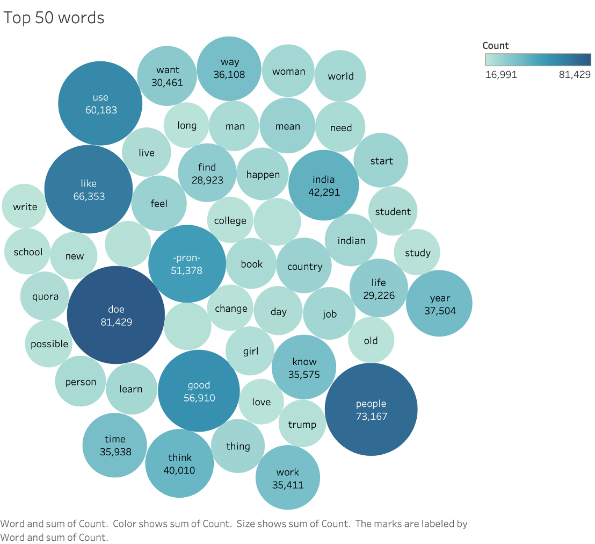
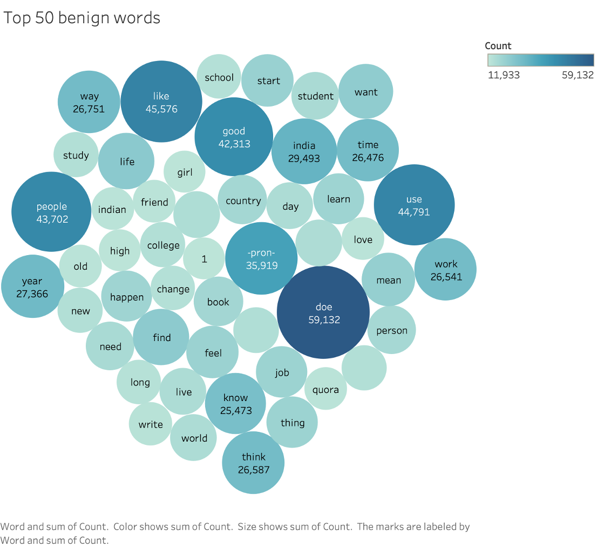
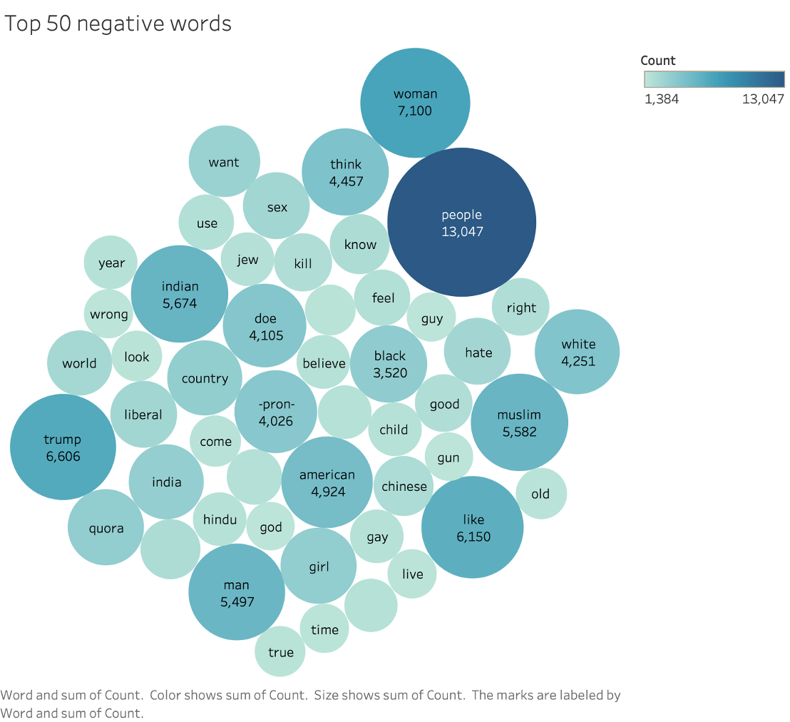

# Quora insincere question classification

## Project brief
One of the imporatnt problem every social network website facing is disive and offensive content on website. This is **classical supervised Natural Languge Processing problem.** It is always good to filter such content when it gets posted and remove it before it goes on website. So, quora posted a really good dataset of such questions with labelled training data with values as 1 and 0; like 1 meaning it is insincere and 0 meaning benign. Test dataset is not labelled we have to generate labels from performance of our model. We used multiple supervised learning algorithms such as **Simple Logistic Regression, Decision Tree Classifier and Stochastic Gradient Classifier and Random Forest Classifier.**

### Dataset Description
Training dataset has column as Question id, Question text and target value while test dataset has all the columns exceept target value. ***Training dataset number of rows is 1306122 rows and 3 columns; test dataset has 375806 rows and 2 columns.*** # Put here picture of training and test dataset.

## Project flow
* Data processing is handelled with pandas libraries. Imported respective 2 files. One of the most important part in NLP based projeect is to tokenize and usee the text data in most effective way. Converted whole text into lower case format and then tokenize them and reemoved stop words from it. After removing all the stop words we lemmatize them; lemmatize is one of the important work to reduce complexity of our data size. Not just only that it will reduce our dataset size. **Just to give idea before doing any of these tasks one sentence length was 22 and after processing using these techniques size got reduced to 6.** So as you can imagine how much this is important. Also to make sure about keeping meaning of the dataset it will reduce the word in a way like running will be reduced to run. 
* So, you can imagine it will convert it to root of that word but not loosing meaning of it. I used primarily Spacy library for this tasks. It will convert this whole bunch of tasks into single one function. And converts final words into string for each row and assigned to Pandas column named as processed_text.

* After processing it I veectorizee whole words and sentences using Tfidf vectorizer with taking maximum number of features as 256 features and also with doing in the way like it will take top 256 features. Because of processing limitation. Because if we want to use more features then we needed more proceessing and hardwares. After vectorizing it applied Different machine learning classification algorithms.

* Applied Logistic Regression, Decision Tree Classifier, Stochastic Gradient Classifier and Random Forest Classifier. One of the imporatnt thing is that we have to predict our test data target column and for that prediction we have to use best algorithm from these 4 agorithms. Also we have used metrices like Precision, Recall, Accuracy and F1 Score.

| Algorithm Name/ Metric Name | Precision     | Recall        | F1 Score      | Accuracy      |      
| --------------------------- | ------------- | ------------- | ------------- | ------------- |
| Logistic Regression         | 76.991        | 56.448        | 59.464        | 94.078        |
| Decision Tree Classifier    | 86.900        | 69.571        | 75.194        | 95.571        | 
| SGD Classifier              | 76.151        | 52.330        | 52.934        | 93.898        |
| Random Forest Classifier    | 89.915        | 69.693        | 75.915        | 95.799        |

By looking at the above table we can say that on every metric Random Forest Classifier performed best on every level of metric. Since the accracy of model goes above 95% we are using random forest classifier as our final model. And using Random Forest classifier to predict our test data. 

## Data analysis & Visualization
I used for data visualization Tableau, Matplotlib and Seaborn.
1. Language of questions
2. Top most frequent 20 words

* **Top 50 words from whole dataset train and test**

## Built with
* Python
* Matplotlib
* Seaborn
* Pandas
* Spacy
* TQDM
* Scikit-Learn
* TfIDF vectorizer

## Authors
* [Yash Choksi](https://www.linkedin.com/in/choksiyash/)

## Acknowledgements
* [Data set URL](https://www.kaggle.com/tunguz/deep-solar-dataset)
* [Project details](http://web.stanford.edu/group/deepsolar/home)
* [Book referred](https://www.amazon.com/Hands-Machine-Learning-Scikit-Learn-TensorFlow/dp/1491962291)
